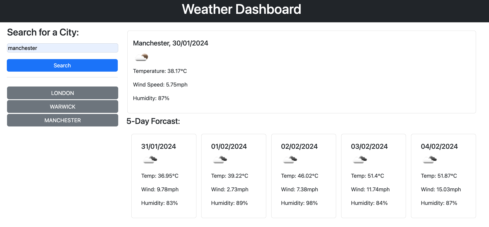

# Weather Dashboard

## Overview

This Weather Dashboard is a web application that utilizes server APIs to fetch weather data from the OpenWeatherMap API and presents it dynamically in the browser through updated HTML and CSS. 

The application leverages localStorage to store persistent data.

## User Story

AS A traveler
I WANT to see the weather outlook for multiple cities
SO THAT I can plan a trip accordingly

## Screen Shot

## Acknowledgements

openweather API
